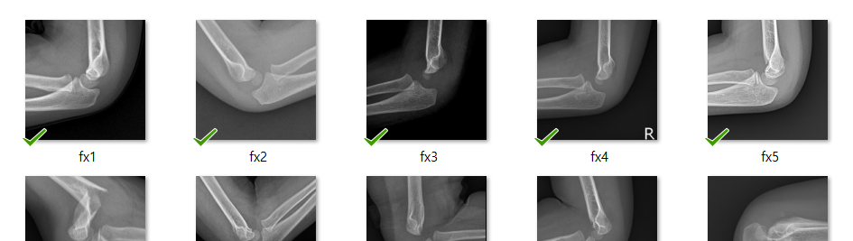
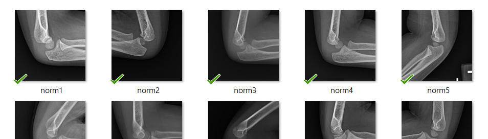
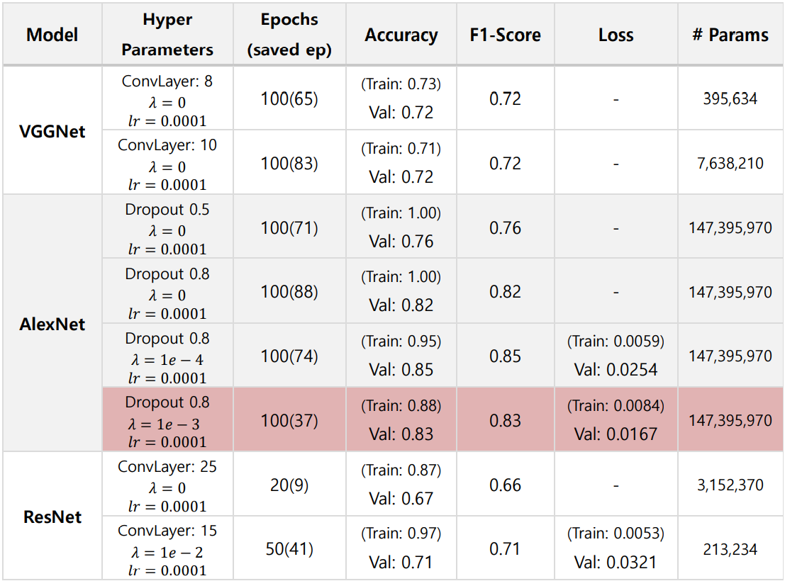
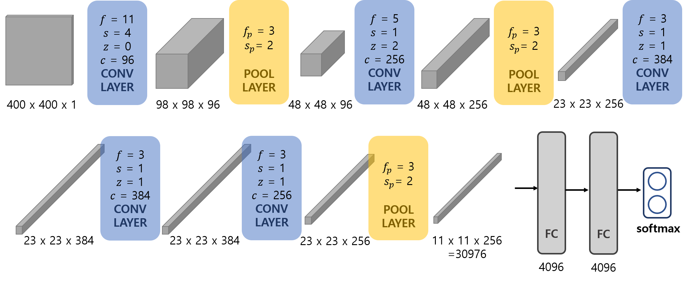
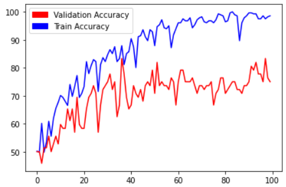
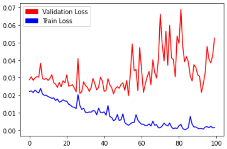

# Bone Fracture Detection

## Overview

Binary classification of bone CT images between normal/fractured bone using covolutional neural networks (CNN). A Total of 353 images (177 fractured, 176 normal) were used for training, with 20% as validation. All images were center-cropped to 400 x 400 dimension. Due to the small size of data, training images were augmented using random horizontal flip(p=0.5).<br>
Variants of VGGNet, AlexNet, and ResNet were trained to classify the images. Out of the three, AlexNet achieved best validation performance, thus was selected as final model to predict test images<br>

This was carried out as a course project for "Pattern Recognition and Machine Learning" taught by Prof. Taehoon Shin at Ewha Womans University. 

## Data
### Train Data
* **Fractured Images:** CT images of fractured bones
  

* **Normal Images:** CT images of normal bones
  

### Test Data
* Mix of fractured and normal bone images

## Model
* **VGGNet** - [Very Deep Convolutional Networks For Large-Scale Image Recognition, 2014, (Karen Simonyan, Andrew Zisserman)](https://arxiv.org/pdf/1409.1556.pdf)
* **AlexNet** - [ImageNet Classification with Deep Convolutional Neural Networks, 2012, (Alex Krizhevsky, Ilya Sutskever, Geoffrey E. Hinton)](https://papers.nips.cc/paper/2012/file/c399862d3b9d6b76c8436e924a68c45b-Paper.pdf)
* **ResNet** - [Deep Residual Learning for Image Recognition, 2015, (Kaiming He, Xiangyu Zhang, Shaoqing Ren, Jian Sun)](https://arxiv.org/pdf/1512.03385.pdf)

All of the models were trained and tested via Pytorch framework. <br>
No pretrained model was used for this project

## Results


**Final Model**<br>

Modified AlexNet with input size 400x400, Dropout(p=0.8), and L2 Regularization(lambda=1e-3)

| Accuracy | Loss |
|:--------:|:----:|
|  |  |

## Structure
```
Bone Fracure Detection
├── README.md
├── code
│   ├───VGG9.ipynb
│   ├───VGG11.ipynb
│   ├───AlexNet.ipynb
│   ├───AlexNet_Drop.ipynb
│   ├───AlexNet_Drop_L2Reg(1e-4).ipynb
│   ├───AlexNet_Drop_L2Reg(1e-3).ipynb
│   ├───ResNet26.ipynb
│   └───ResNet16.ipynb
│
├── report.pdf
│   
```
<!-- 
**Todo**
- refactor directory structure 
  - code-train/test folder 나누기
- test code 정리
- test accuracy 여쭤보기 >> 추가
>